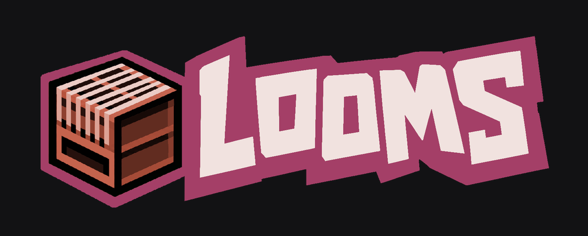

**Free modular wardrobe for Minecraft skins.**  
Browse clothing layers, stack outfits in Studio, export a vanilla PNG.

**[Live site](https://looms-gg.github.io/looms-web/)** · **[Discord](https://discord.gg/UNTRgHBBPb)**

---

## Got an idea?

looms is open source. Feature requests, piece ideas, and UX feedback belong in Discord — that is where the community shapes what we build next.

[Join the Discord](https://discord.gg/UNTRgHBBPb) and tell us what you want to wear, browse, or fix!

GitHub is for developers: pull requests, code review, and bugs that need a reproducible case.

---

## Docs


| Doc                                                             | What it covers                     |
| --------------------------------------------------------------- | ---------------------------------- |
| [PRODUCT.md](PRODUCT.md)                                        | Who looms is for and why it exists |
| [DESIGN.md](DESIGN.md)                                          | Visual system and UI tokens        |
| [AGENTS.md](AGENTS.md)                                          | Rules for contributors and agents  |
| [Threat modeling](docs/THREAT_MODELING_AND_ABUSE_PREVENTION.md) | Security and abuse prevention      |


---


## For developers

Stack: Vite, React, TypeScript, Tailwind CSS 4, daisyUI 5, Supabase.

```bash
npm install
npm run dev
npm test
npm run build
```

Copy `[.env.example](.env.example)` to `.env` (and/or `.env.local` for `VITE_*` keys). Deploy with `./deploy.command` after `gh auth login` — that pushes `main`, applies Supabase migrations, and publishes to GitHub Pages.

PRs welcome. Talk through bigger ideas on Discord first so we are not building past each other!